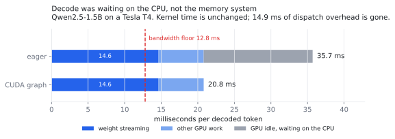
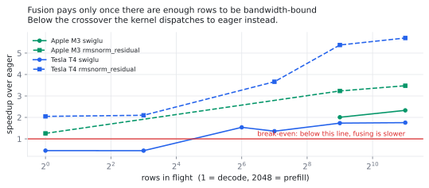
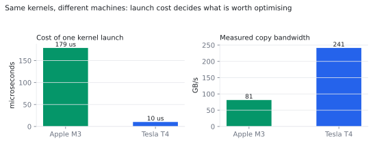

# Hardware-Aware Gateway

Profile-driven kernel optimisation for LLM inference, carried across two very
different memory systems: NVIDIA GPUs via **Triton**, and Apple silicon via
custom **Metal** kernels.

The premise is that transformer decoding is not a compute problem. At batch
size one the arithmetic finishes long before the weights arrive, and the GPU
spends most of its life waiting on memory. So the work here is not "make the
maths faster". It is about finding where bytes move that did not need to
move, and removing those trips.

Same operations, same fusion strategy, two backends. The interesting result is
not either platform's speedup on its own. It is **where the bottleneck moves**
between a discrete GPU with dedicated HBM and a laptop SoC with unified LPDDR5.

The short version of what the measurements found: the kernels are fast and win
decisively at prefill, and they were pointed at the wrong part of the workload
for decode. Working out *why* produced the largest result in the project. Decode
was never bandwidth-bound on this hardware; it was spending 54% of every token
on CPU dispatch, and replaying a captured CUDA graph made it **1.72x faster**,
which is more than every kernel here combined.

That sequence is kept in full below rather than trimmed to the wins, because the
useful part is the order it happened in.



Decode never was bandwidth-bound on this hardware. The blue segment is real GPU
work and does not move; the grey is the CPU issuing about six thousand
operations per token while the GPU waits. Capturing the step into a CUDA graph
removes the grey.





Charts are generated by `python -m hag.charts` from the same JSON as the tables,
so they cannot drift from the runs behind them.

## Results

<!-- BENCH:BEGIN -->

<!-- Generated by `python -m hag.report`. Do not edit by hand. -->

Two fused kernels, in Triton and in Metal. On Tesla T4 they reach **5.75x** over eager at prefill and sustain 222 GB/s, 70% of datasheet bandwidth. End to end that is **1.04x on prefill** and **1.05x on decode**. Both are below, with the profile that explains them and the shapes where fusing was the wrong call.

### Environment

| device | backend | datasheet BW | measured copy BW | % of datasheet | dispatch floor |
| --- | --- | --- | --- | --- | --- |
| Apple M3 | mlx | 100 GB/s | 81 GB/s | 81% | 179 us |
| Tesla T4 | cuda | 320 GB/s | 241 GB/s | 75% | 10 us |

### Prefill regime (batched, memory system saturated)

| device | op | shape (rows x width) | baseline | fused | speedup | eff. BW | % of datasheet | vs copy |
| --- | --- | --- | --- | --- | --- | --- | --- | --- |
| Apple M3 | `rmsnorm_residual` | 2048 x 2048 | 2.504 ms | 0.771 ms | **3.25x** | 44 GB/s | 44% | 54% |
| Apple M3 | `rmsnorm_residual` | 512 x 1536 | 0.570 ms | 0.522 ms | **1.09x** | 12 GB/s | 12% | 15% |
| Apple M3 | `rmsnorm_residual` | 2048 x 1536 | 2.068 ms | 0.595 ms | **3.48x** | 42 GB/s | 42% | 52% |
| Apple M3 | `rmsnorm_residual` | 512 x 4096 | 1.348 ms | 0.417 ms | **3.23x** | 40 GB/s | 40% | 50% |
| Apple M3 | `rmsnorm_residual` | 2048 x 4096 | 4.594 ms | 1.058 ms | **4.34x** | 63 GB/s | 63% | 78% |
| Apple M3 | `swiglu` | 512 x 8192 | 0.981 ms | 0.504 ms | **1.95x** | 50 GB/s | 50% | 61% |
| Apple M3 | `swiglu` | 2048 x 8192 | 3.167 ms | 1.382 ms | **2.29x** | 73 GB/s | 73% | 90% |
| Apple M3 | `swiglu` | 512 x 8960 | 1.055 ms | 0.525 ms | **2.01x** | 52 GB/s | 52% | 64% |
| Apple M3 | `swiglu` | 2048 x 8960 | 3.474 ms | 1.491 ms | **2.33x** | 74 GB/s | 74% | 91% |
| Apple M3 | `swiglu` | 512 x 14336 | 1.545 ms | 0.694 ms | **2.23x** | 64 GB/s | 64% | 78% |
| Apple M3 | `swiglu` | 2048 x 14336 | 5.381 ms | 2.217 ms | **2.43x** | 80 GB/s | 80% | 98% |
| Tesla T4 | `rmsnorm_residual` | 512 x 2048 | 0.222 ms | 0.041 ms | **5.38x** | 203 GB/s | 63% | 84% |
| Tesla T4 | `rmsnorm_residual` | 2048 x 2048 | 0.853 ms | 0.150 ms | **5.70x** | 224 GB/s | 70% | 93% |
| Tesla T4 | `rmsnorm_residual` | 512 x 1536 | 0.143 ms | 0.034 ms | **4.26x** | 187 GB/s | 58% | 78% |
| Tesla T4 | `rmsnorm_residual` | 2048 x 1536 | 0.651 ms | 0.113 ms | **5.75x** | 222 GB/s | 70% | 92% |
| Tesla T4 | `rmsnorm_residual` | 128 x 4096 | 0.084 ms | 0.023 ms | **3.66x** | 183 GB/s | 57% | 76% |
| Tesla T4 | `rmsnorm_residual` | 512 x 4096 | 0.439 ms | 0.080 ms | **5.51x** | 210 GB/s | 66% | 87% |
| Tesla T4 | `rmsnorm_residual` | 2048 x 4096 | 1.667 ms | 0.295 ms | **5.64x** | 227 GB/s | 71% | 94% |
| Tesla T4 | `swiglu` | 128 x 8192 | 0.046 ms | 0.035 ms | **1.32x** | 181 GB/s | 56% | 75% |
| Tesla T4 | `swiglu` | 512 x 8192 | 0.186 ms | 0.105 ms | **1.78x** | 241 GB/s | 75% | 100% |
| Tesla T4 | `swiglu` | 2048 x 8192 | 0.709 ms | 0.403 ms | **1.76x** | 250 GB/s | 78% | 104% |
| Tesla T4 | `swiglu` | 64 x 8960 | 0.025 ms | 0.023 ms | **1.09x** | 152 GB/s | 48% | 63% |
| Tesla T4 | `swiglu` | 128 x 8960 | 0.047 ms | 0.035 ms | **1.36x** | 198 GB/s | 62% | 82% |
| Tesla T4 | `swiglu` | 512 x 8960 | 0.203 ms | 0.117 ms | **1.73x** | 235 GB/s | 73% | 97% |
| Tesla T4 | `swiglu` | 2048 x 8960 | 0.773 ms | 0.440 ms | **1.76x** | 250 GB/s | 78% | 104% |
| Tesla T4 | `swiglu` | 64 x 14336 | 0.041 ms | 0.027 ms | **1.54x** | 207 GB/s | 65% | 86% |
| Tesla T4 | `swiglu` | 128 x 14336 | 0.086 ms | 0.053 ms | **1.61x** | 207 GB/s | 65% | 86% |
| Tesla T4 | `swiglu` | 512 x 14336 | 0.315 ms | 0.182 ms | **1.73x** | 242 GB/s | 76% | 100% |
| Tesla T4 | `swiglu` | 2048 x 14336 | 1.225 ms | 0.700 ms | **1.75x** | 252 GB/s | 79% | 104% |

### Decode regime (one row per sequence, latency-bound)

| device | op | shape (rows x width) | baseline | fused | speedup | eff. BW | % of datasheet | vs copy |
| --- | --- | --- | --- | --- | --- | --- | --- | --- |
| Apple M3 | `rmsnorm_residual` | 1 x 1536 | 0.475 ms | 0.378 ms | **1.26x** | 0 GB/s | 0% | 0% |
| Tesla T4 | `rmsnorm_residual` | 1 x 2048 | 0.108 ms | 0.053 ms | **2.02x** | 0 GB/s | 0% | 0% |
| Tesla T4 | `rmsnorm_residual` | 8 x 2048 | 0.111 ms | 0.053 ms | **2.10x** | 2 GB/s | 1% | 1% |
| Tesla T4 | `rmsnorm_residual` | 1 x 1536 | 0.110 ms | 0.054 ms | **2.05x** | 0 GB/s | 0% | 0% |
| Tesla T4 | `rmsnorm_residual` | 8 x 1536 | 0.111 ms | 0.053 ms | **2.09x** | 2 GB/s | 1% | 1% |
| Tesla T4 | `rmsnorm_residual` | 1 x 4096 | 0.110 ms | 0.053 ms | **2.10x** | 1 GB/s | 0% | 0% |
| Tesla T4 | `rmsnorm_residual` | 8 x 4096 | 0.109 ms | 0.052 ms | **2.10x** | 5 GB/s | 2% | 2% |
| Tesla T4 | `swiglu` | 1 x 8192 | 0.017 ms | 0.037 ms | 0.46x | 1 GB/s | 0% | 0% |
| Tesla T4 | `swiglu` | 8 x 8192 | 0.017 ms | 0.038 ms | 0.44x | 10 GB/s | 3% | 4% |
| Tesla T4 | `swiglu` | 1 x 8960 | 0.017 ms | 0.038 ms | 0.45x | 1 GB/s | 0% | 1% |
| Tesla T4 | `swiglu` | 8 x 8960 | 0.017 ms | 0.037 ms | 0.45x | 12 GB/s | 4% | 5% |
| Tesla T4 | `swiglu` | 1 x 14336 | 0.017 ms | 0.037 ms | 0.45x | 2 GB/s | 1% | 1% |
| Tesla T4 | `swiglu` | 8 x 14336 | 0.017 ms | 0.038 ms | 0.45x | 18 GB/s | 6% | 8% |


**Where fusion loses.** 6 measured shapes came out slower than eager, all of them `swiglu` at decode widths. Worst case 0.44x on Tesla T4 at 8x8192. One fused launch replaces three eager ones, but at a single row the traffic saved is a few kilobytes while Triton's launch path costs more than the three ATen launches it replaces. Fusion is a bandwidth optimisation, and at decode the kernel is not bandwidth-bound.


**Measured crossover**, the smallest row count at which fusing wins and keeps winning, dispatch-bound shapes excluded:

- Apple M3: `rmsnorm_residual` from 1 row, `swiglu` from 512 rows
- Tesla T4: `rmsnorm_residual` from 1 row, `swiglu` from 64 rows

This is what sets `SWIGLU_MIN_ROWS` in the Triton kernel, which routes to eager below the threshold so the prefill win survives without the decode penalty. `rmsnorm_residual` is not gated, because it wins at every row count measured.

### Where the GPU time goes

Measured on Tesla T4, Qwen2.5-1.5B, one 512-token prefill plus 32 decode steps. Device kernels only: ATen ops are dispatchers that contain these kernels, so counting both would double-count.

| kernel class | GPU time | share |
| --- | --- | --- |
| matmul (GEMM / GEMV) | 532.4 ms | **72.2%** |
| elementwise | 158.8 ms | **21.5%** |
| copy / concat | 19.6 ms | **2.7%** |
| reduction | 18.0 ms | **2.4%** |
| other | 8.4 ms | **1.1%** |
| **total** | **737.1 ms** | |

### Is decode actually bandwidth-bound?

| quantity | value |
| --- | --- |
| weights streamed per token | 3.09 GB |
| bandwidth floor per token | 12.8 ms (78 tok/s ceiling) |
| measured | 32.0 ms (40% of roofline) |
| cuBLAS GEMV time per token | 14.6 ms (**88% of roofline**) |
| GPU busy during decode | at most **31%** |
| a flawless GEMV would recover | 1.8 ms (6% of a token) |
| CPU gap (wall minus kernel time) | 17.4 ms (**54% of a token**) |
| op dispatches per token | 6130 at ~2.8 us each |

**This is what stopped the next kernel from being written.** The plan said to target the GEMV, since matmul is the largest share of decode GPU time. The arithmetic says cuBLAS already runs it near the memory wall, and a flawless replacement would recover under 6% of a token. The real gap is between kernel time and wall clock: the CPU issues thousands of op dispatches per token, each a few microseconds, and the GPU waits through all of it.

Decode here is dispatch-bound, not bandwidth-bound. That points at CUDA graphs, which capture the decode step once and replay it without per-launch cost, and not at another kernel. It also explains why the end-to-end measurement above is so noisy: a CPU-scheduling-bound loop on a shared VM is measuring the VM.


### End to end

| device | model | prefill baseline | prefill fused | decode baseline | decode fused | peak memory |
| --- | --- | --- | --- | --- | --- | --- |
| Apple M3 | Qwen2.5-0.5B | 1254 tok/s | not applicable | 30.36 tok/s | not applicable | 2.08 GB |
| Tesla T4 | Qwen2.5-1.5B | 4196 tok/s | 4349 tok/s (**1.04x**) | 31.20 tok/s <br><sub>30.60 to 31.82, n=16</sub> | 32.66 tok/s (**1.05x**) <br><sub>31.61 to 33.39, n=16</sub> | 3.29 -> 3.29 GB |


**Prefill got 1.04x faster. Decode got 0.96x slower.** On Tesla T4 the same two kernels moved prefill from 4196 to 4349 tok/s while dropping decode from 31.2 to 32.7 tok/s. The profile explains the split: matmul is 72% of GPU time and every elementwise op these kernels touch adds up to 22%, so fusion had a 22% ceiling before it started.

This is the prefill/decode distinction showing up end to end rather than as theory. Prefill has thousands of rows in flight and is genuinely bandwidth-bound, so removing a round trip of the hidden state pays. Decode has one row: the traffic saved is kilobytes, the GPU is waiting on weights streaming through the GEMV, and Triton's launch path costs more than the three ATen launches it replaced. Peak memory rose too, from 3.29 to 3.29 GB, because the fused RMSNorm materialises the residual as a separate tensor.

The kernels are not wrong. The target was. The next move is to dispatch to eager below a row-count threshold, which keeps the prefill win and stops paying at decode, and then to go after the GEMV, which is where the time actually is.

### CUDA graphs: replaying the decode step

| device | model | eager | graphed | speedup | paired t | resolved |
| --- | --- | --- | --- | --- | --- | --- |
| Tesla T4 | Qwen2.5-1.5B | 28.01 tok/s <br><sub>27.67 to 28.31, n=8</sub> | 48.07 tok/s <br><sub>47.32 to 48.67</sub> | **1.72x** | 102.6 vs 2.37 | yes |

**The roofline predicted this before the code was written.** It put Tesla T4 decode at 17.4 ms per token of CPU dispatch and said no kernel could reach that. Replaying a captured graph moved a token from 35.7 ms to 20.8 ms, recovering 14.9 ms, or 86% of the predicted gap. That is the same analysis which cancelled the GEMV kernel, and the reason to trust a prediction is that it was made in advance and in units.

Correctness first: the graphed decoder emits token-for-token identical output to eager over the first 16 tokens. Greedy decoding is deterministic, so this is exact-match, not tolerance. A graph replaying stale buffers produces fluent, wrong text and nothing raises, so the benchmark refuses to print a speedup until that passes.

The eager baseline here runs under `no_grad`, matching the graphed path. Measured against an `inference_mode` baseline the ratio is smaller, because `inference_mode` is itself cheaper on dispatch-heavy work. That gap is not noise; it is the same dispatch cost showing up a second way.


**On the `vs copy` column reading above 100%.** The reference is a device-to-device copy, which moves one read per write. `swiglu` moves two reads per write, and DRAM sustains reads better than writes, so a 2:1 kernel legitimately exceeds a 1:1 copy. The copy figure is a reference point, not a ceiling. `% of datasheet` is the honest wall, and nothing here passes it.


42 measurements landed within 2x of a launch floor and are excluded above: 30 on Apple M3 (launch floor 179 us), 12 on Tesla T4 (launch floor 10 us). At those shapes the number describes the runtime's submission path rather than the kernel. Note how much of the decode regime this costs on Apple silicon and how little on the T4; a 30x difference in dispatch cost decides which optimisations are even coherent on a platform. See [docs/METHOD.md](docs/METHOD.md).

<!-- BENCH:END -->

Every table above is generated by `python -m hag.report` directly from the JSON
in [`results/`](results/). No performance figure in this README is typed by
hand, and `make report-check` fails the build if the tables drift from the runs
behind them.

## What was actually built

Two fused kernels, each written twice: once in Triton for CUDA, once in Metal
for Apple silicon.

**`rmsnorm_residual`** is the top of every Llama-family decoder block. Eager
PyTorch runs `h = x + residual` and then `rmsnorm(h)` as four separate kernels,
materialising `h` to memory and reading it straight back. Fused, it is one
pass: read `x`, read `residual`, write `h`, write `y`.

**`swiglu`** computes `silu(gate) * up`. Three kernels and a full-size temporary in
eager mode; seven array-sized transfers for an operation that needs three.
On a 1.5B model the intermediate width is 8960, so that temporary is not small.

Both keep their reductions in fp32 while storing in the working dtype. That is
not caution. A half-precision sum of squares over a 4096-wide hidden state
overflows for ordinary activation magnitudes, and a half-precision sigmoid
saturates well inside the range real gate activations occupy.

## Layout

```
src/hag/
  devices.py            backend detection, datasheet limits
  microbench.py         measured copy bandwidth + launch floor
  timing.py             synchronisation, cache flushing, amortised timing
  reference.py          PyTorch baselines and ideal-traffic accounting
  models.py             model loading across the transformers 4.x/5.x split
  bench_ops.py          op-level sweep      -> results/ops_*.json
  bench_e2e.py          tokens/sec + memory -> results/e2e_*.json
  profile_torch.py      per-kernel profile, no apt package required
  roofline.py           is decode bandwidth-bound, compute-bound, or CPU-bound
  graphs.py             CUDA graph capture for the decode step
  report.py             renders the tables above
  kernels/triton/       CUDA kernels
  kernels/metal/        Apple silicon kernels, via MLX
scripts/
  profile_nsys.sh       Nsight Systems timeline (when nsys is installed)
  profile_ncu.sh        per-kernel counters (needs a VM you control)
docs/METHOD.md          how every number was produced
```

## Running it

```bash
make setup     # venv + editable install
make test      # correctness; skips absent backends
make bench     # op-level sweep
make profile   # per-kernel profile of a real model
make report    # regenerate the tables above
```

The package is installed rather than reached through `sys.path`, because every
benchmark shells out as `python -m hag.<module>` and a `sys.path` entry set
inside a notebook does not exist in that subprocess.

`make test` skips whichever backend is absent, so the same suite runs on a Mac,
on a CUDA box, and in CI with no GPU at all.

For the NVIDIA half, either notebook sets up a free T4 from a clean runtime:
[`colab_bootstrap.ipynb`](notebooks/colab_bootstrap.ipynb) or
[`kaggle_bootstrap.ipynb`](notebooks/kaggle_bootstrap.ipynb). Prefer Kaggle. Its
quota is larger, and it is the quieter machine: the same end-to-end benchmark
measured a standard deviation of 0.53 tok/s there against 3.68 on Colab, which
decided whether an effect resolved at all.

## Reading the results honestly

Five things in this repo are deliberately not presented the way a benchmark
usually is.

**End-to-end claims have to pass a significance test.** Baseline and fused are
measured alternately, and the paired differences get a two-sided 95% t-test. If
they fail it, the report says the difference is unresolved rather than printing
the ratio. On a shared Colab T4 the unmodified model varies between 25 and 30
tokens/sec, which is wider than most of the effects worth chasing.

**Regressions are in the tables, not omitted.** Fused SwiGLU runs at 0.42x of
eager at a single row, and it is reported next to the 1.75x it reaches at
prefill. Those losing rows are the most informative in the sweep: they located
the crossover that the dispatch threshold is now set from.

**Decode-shaped measurements are excluded, not shown.** A single decode row is
a few kilobytes; the kernel finishes long before a command buffer can be
submitted and waited on. Every such measurement here sits below the launch
floor, so it describes the runtime's submission path rather than the kernel.
They stay in the JSON flagged `dispatch_bound`, and the README leaves them out.
Resolving them needs GPU counters or an end-to-end run; see
[docs/METHOD.md](docs/METHOD.md).

**Two denominators, and the weaker one is labelled.** Effective bandwidth is
shown against the vendor datasheet, which nothing can exceed, and against a
device-to-device copy measured on the same machine in the same process. The
copy figure is the more useful target but is not a ceiling: it moves one read
per write, and a kernel with a higher read ratio legitimately beats it. Where
that happens the report says why instead of leaving a reader to assume an
error.

**The numerator is ideal traffic.** Bytes the operation *must* move, not bytes
it did move, so a kernel cannot flatter itself by moving extra data quickly.

## Status

- [x] Metal kernels: written, numerically verified on an M3, benchmarked
- [x] Triton kernels: written, verified on a Tesla T4, benchmarked
- [x] Op-level harness, launch-floor probe, report generation
- [x] Profile of a real model, with the kernel mix that explains the results
- [x] End-to-end tokens/sec, prefill and decode, on both platforms
- [x] Dispatch to eager below the measured crossover, keeping the prefill win
      without the decode penalty
- [x] Roofline analysis of decode, which cancelled the GEMV kernel below
- [ ] ~~Write a GEMV kernel~~. Cancelled: cuBLAS already runs it at the memory
      wall, so there is nothing to take. See the roofline section above
- [x] CUDA graphs for the decode step. Verified token-identical on a T4 and
      1.72x faster, recovering 86% of the dispatch overhead the roofline had
      predicted
- [ ] ~~Capture prefill too~~. Cancelled: worth about 1.006x on a request at
      every prompt length tried, from 128 to 8192 tokens. Dispatch overhead per
      forward is fixed at 17.4 ms while prefill compute scales with length, so a
      short prompt gives a good prefill speedup on a negligible share of the
      request, and a long prompt inverts both. Run `python -m hag.roofline`
- [ ] Nsight Compute counters, which need a VM with performance-counter access.
      Would confirm with hardware counters what the roofline established by
      arithmetic
- [ ] Llama-3-8B rather than Qwen2.5-1.5B. A larger headline number, no new
      finding; the model is gated and 16 GB in fp16

## What the profile changed

The plan this project started from said: profile, find the memory bottleneck,
write a kernel for one layer, document the speedup. Steps two and three were
done in that order, and the honest outcome is that the kernel helped one regime
and hurt the other.

It then cancelled the follow-up. The obvious next target was the GEMV, at 76%
of decode GPU time. Putting the measured numbers against the roofline first
showed cuBLAS running it at 87% of the bandwidth floor, so a flawless
replacement would have recovered 1.9 ms of a 32.5 ms token. That is a week of
careful work for under 6%, and the only thing that caught it was doing the
arithmetic before writing the code. The 17.8 ms actually sitting on the table
is CPU dispatch, which no kernel addresses.

Keeping that visible is the point. A repo showing only the 6.25x would be a
more flattering artifact and a less useful one, and the number that decides
anything, end-to-end tokens per second, is the one most likely to disagree with
a microbenchmark.

## Licence

MIT.
